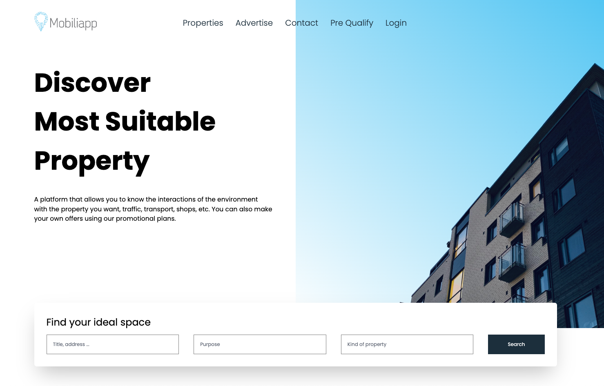

# Achieve

### [Achieve](https://www.achieve.com/) and [Freedom Debt Relief](https://www.freedomdebtrelief.com/)

<!-- - CI/CD using <a href="https://git-scm.com/">Git</a> and <a href="https://bitbucket.org/"> Bitbucket</a>
- Server side rendering & Frontend: <a href="https://react.dev/"> React.js</a>, <a href="https://nextjs.org/"> Next.js</a>
- RESTful api design: <a href=""> Python</a>, <a href="https://www.djangoproject.com/">Django</a>, <a href="https://www.django-rest-framework.org/">Django REST framework</a>
- <a href=""> PostgreSQL</a>
- Payment integrations: CardNet, Paypal, Azul
- Content delivery network (CDN): <a href="https://www.digitalocean.com/products/spaces"> DigitalOcean storage spaces (S3-Compatible)</a>
- <a href="https://www.nginx.com/"> Nginx</a>

   Screenshots:    -->

As a software developer at Achieve.com, my role involves building and optimizing a seamless, high-performance web platform using cutting-edge technologies like **Next.js**. I focus on crafting scalable, SEO-friendly applications with server-side rendering (SSR) for fast load times and smooth user experiences.

A key aspect of my work includes **website optimization**—ensuring high performance across all devices by fine-tuning core web vitals such as LCP, FID, and CLS. I’ve implemented strategies like lazy loading, code splitting, and aggressive caching to speed up page load times. **Cloudflare** plays a crucial role here, where I manage CDN configurations, improve security, and minimize latency, ensuring fast global access and protection from DDoS attacks.

To maximize user engagement, I’ve also integrated **A/B testing** frameworks to test different design and feature variations, ensuring data-driven decisions that improve user retention and conversion rates. Using **session recording tools**, I track user interactions to identify friction points and improve the overall usability of the platform.

Additionally, I’ve worked on integrating various **APIs**—from third-party services to internal systems—ensuring smooth, real-time data exchanges and enriching the user experience. This end-to-end focus on both front-end performance and back-end integrations allows Achieve.com to continuously innovate while maintaining a fast, secure, and user-friendly platform.

#### Technologies

- [ Next.js](https://nextjs.org/)
- [ React](https://react.dev/)
- [ NodeJS](https://nodejs.org/)
- [ LaunchDarkly](https://launchdarkly.com)
- [ Bitbucket](https://bitbucket.org/) 
- [ Kubernetes](https://kubernetes.io/)
- [ GCP](https://cloud.google.com/)
- Site readability
- Site optimization
- Responsive design

#### Showcase

<video src="./videos/achieve-1.mp4"/>

<video src="./videos/fdr-1.mp4" />
