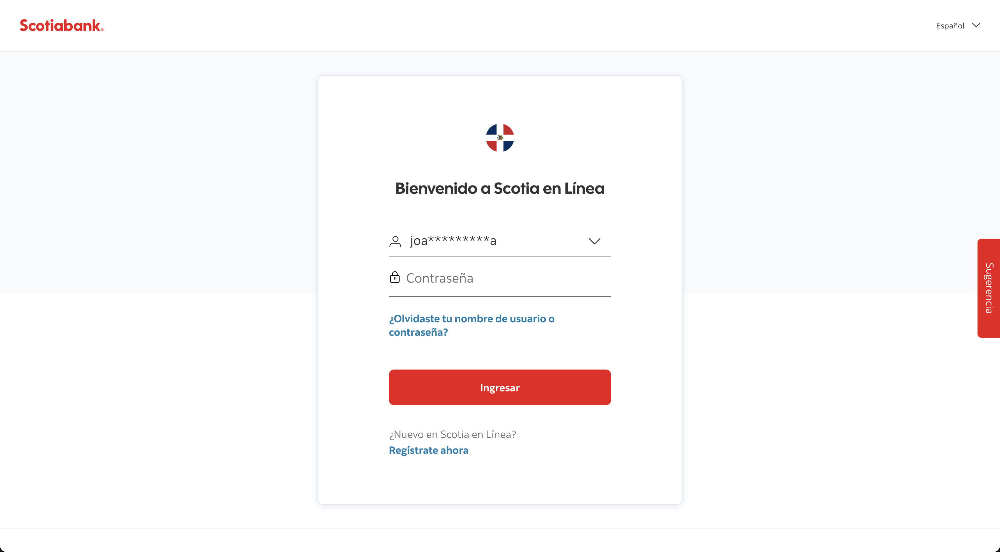

# Scotiabank

### [Online banking platform](http://banking.online.scotiabank.com/account?country=DO&language=es)

I've create and maintain high performance code over 90% testability, improving React.js project growing code-base, implementing algorithms and techniques to optimize the load and response times, payment integrations and best code practices for an international internet banking platform.

Build login and dashboard features for major Latin-American online internet banking.

#### Technologies

- [ Node.js](https://nodesjs.org/)
- [ React.js](https://react.dev/)
- [Web Content Accessibility Guidelines](https://developer.mozilla.org/en-US/docs/Web/Accessibility)
- Enterprise API integration
- A/B Testing, Feature toggling

**Screenshots**:

